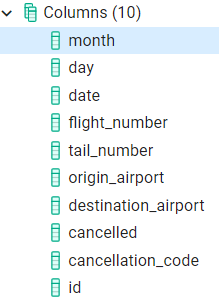

# Group 12 ETL Project
----------------------

# Introduction

Due to the ramifications of the ongoing COVID-19 pandemic on the global airline industry, our team evaluated the number of flight cancellations. 
This project compared flight cancellations on domestic flights in the United States for 2015 and 2020. The associated two databases were presented in csv format and the source data was originally collected from the U.S. Department of Transportation's (DOT) Bureau of Transportation Statistics. The datasets used for this project were obtained from the public platform Kaggle and can be retrieved at these links:

https://www.kaggle.com/akulbahl/covid19-airline-flight-delays-and-cancellations  
https://www.kaggle.com/akulbahl/covid19-airline-flight-delays-and-cancellations 

# Project Steps
The purpose of this project was to manipulate the flight cancellation data so that successful extraction and transformation could be performed. The following steps were implemented.
# Extract
The original data from two sources (2015 and 2020 flight cancellations) were extracted from their respective csv files. 
Transform
Python was used to clean the original data and join the two datasets, filtering and leaving only essential data (see figure below). The merged dataset was then properly formatted.
It should be noted that the 2015 data required substantial manipulation as only January and February data could be used for comparison to the available data for 2020. We further purged from the dataset all delays and kept only cancellations. Initially, there were 47 columns, but a majority of this information was only relevant to the delayed flights and was removed.

# Load
The final step in the ETL process consisted of loading the data into a final database that can be used for future analyses. Various databases, both relational (SQL) and non-relational (MongoDB), were considered. Ultimately, pgAdmin/PostgresSQL was selected as the most suitable production database for this application.
Figure 1 below shows the parameters included in the final database. As part of the manipulation of the original data, a unique ID for each flight was created through concatenating month, day, flight number and tail number into a single tag. The same airplane may fly the same route multiple days per year, so organizing the data this way ensured that each cancelled flight had a unique ID. 

**Figure 1** 	      		| **SQL Code**                                                   
--------------------------------| -------------------------------------------------------------------------------------------
 |                                                              

**Example Data Output** 
------------------

## Contributors

[Lydia Field](https://github.com/lydiapf): lydia291@gmail.com

[Rodrigo Reyes](https://github.com/rodking96): rodrigoreyes96@gmail.com

[Alessandro Travaglia](https://github.com/atravaglia) : atravaglia@gmail.com

UNC Boot Camp 2020